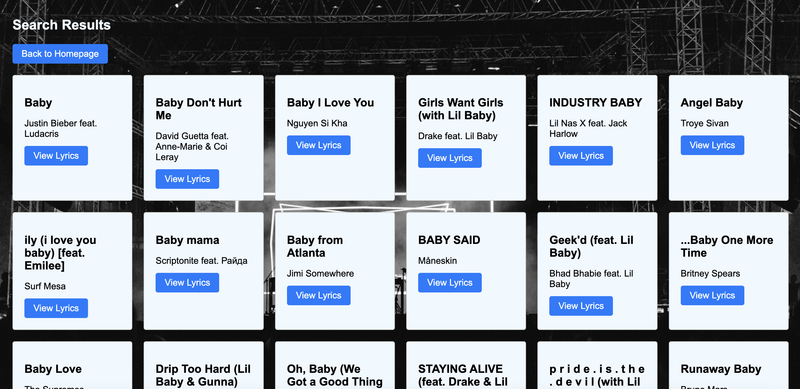
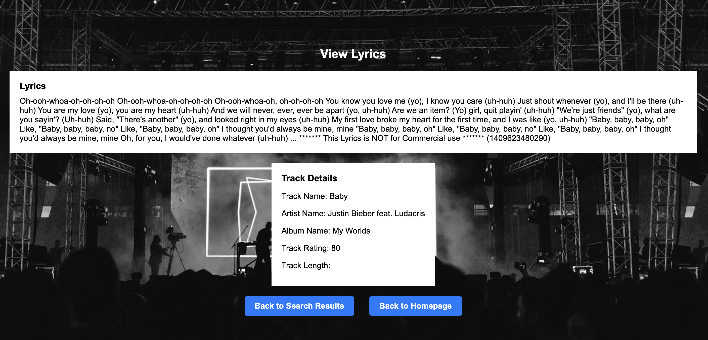
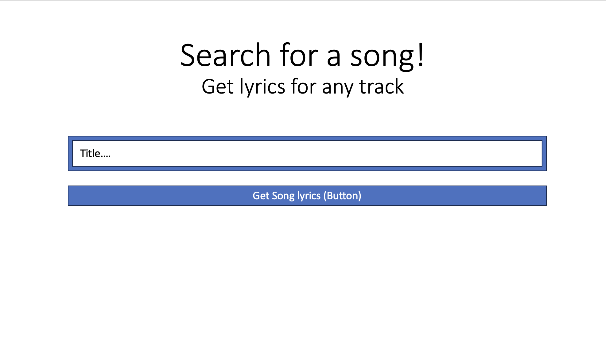
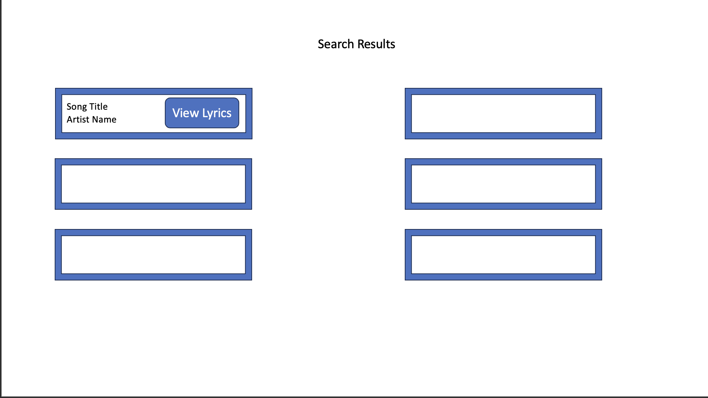
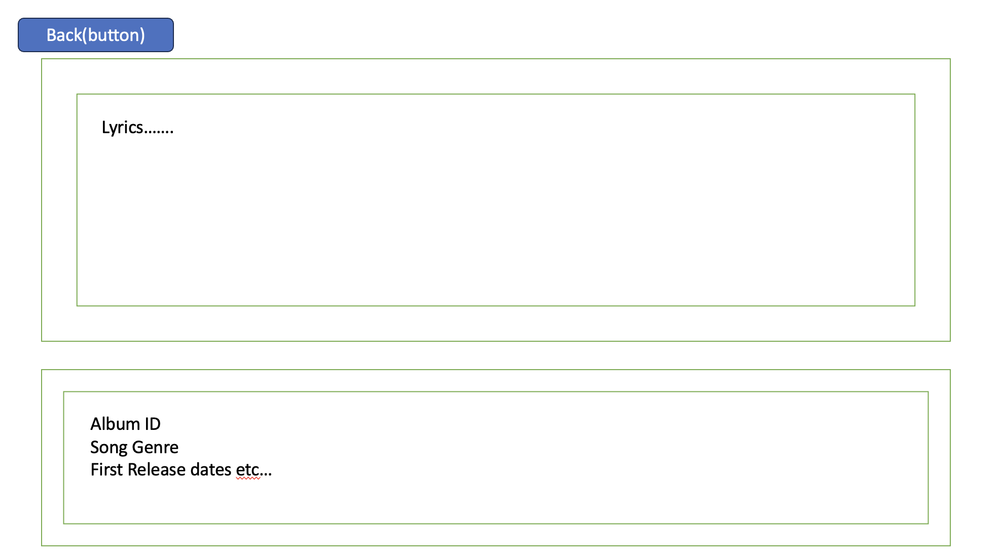

Project Title: LyricSearch Web Application

Screenshot(s)

Description: The Lyric Search app is a web application designed to provide users with a convenient way to search for song lyrics. Users can enter the title of a song and instantly retrieve the corresponding lyrics, allowing them to sing along or explore the meaning behind their favorite tracks.

Wireframe

Technology Used:

- React
- Vite
- Musixmatch API

Key Components:

1. HomePage:

   - This component serves as the landing page for the LyricSearch application.
   - Functionality: Users can enter the title of a song in the search input field and click the "Search" button to initiate the search for lyrics.

2. SearchResultPage:

   - This component displays the search results for a specific song query.
   - Functionality: It sends a request to the Musixmatch API with the provided song title and retrieves the list of matching songs. Each search result is displayed as a card containing the track name and artist name. Users can click the "View Lyrics" button to view the lyrics for a specific song.

3. ChosenSongPage:
   - This component displays the lyrics and additional details for a chosen song.
   - Functionality: It sends a request to the Musixmatch API to fetch the lyrics and track details for the selected song. The lyrics are displayed in a dedicated section, and the track details, including the track name, artist name, album name, track rating, and track length, are displayed in another section.

Routes:

- Homepage:

  - Route Path: "/"
  - Purpose: This route directs users to the homepage of the Lyric Search app, where they can initiate song searches.

- Search Results Page:

  - Route Path: "/search/:query"
  - Purpose: This route displays the search results for a specific song query. Users can select a song from the results to view its lyrics.

- Chosen Song Page:
  - Route Path: "/song/:id"
  - Purpose: This route displays the chosen song's lyrics and additional track details. Users can navigate back to the search results or the homepage from this page.

Design Considerations:

- The user interface is designed to be user-friendly and intuitive, providing a seamless experience for searching and viewing song lyrics.
- The application incorporates a purple background color, providing a visually appealing and consistent theme across all pages.
- The use of spinner loaders ensures a smooth transition between loading states and prevents the "No search results found" message from appearing momentarily.
- The search button is disabled when the input field is empty, ensuring that users must enter a song title to initiate a search.

By leveraging the Musixmatch API and incorporating a user-friendly interface, the Lyric Search app simplifies the process of finding song lyrics, allowing users to explore their favorite songs in depth and enhance their musical experience.

API used:
-Musixmatch
https://developer.musixmatch.com/

Deployed app -https://lyrics-app-two.vercel.app/
